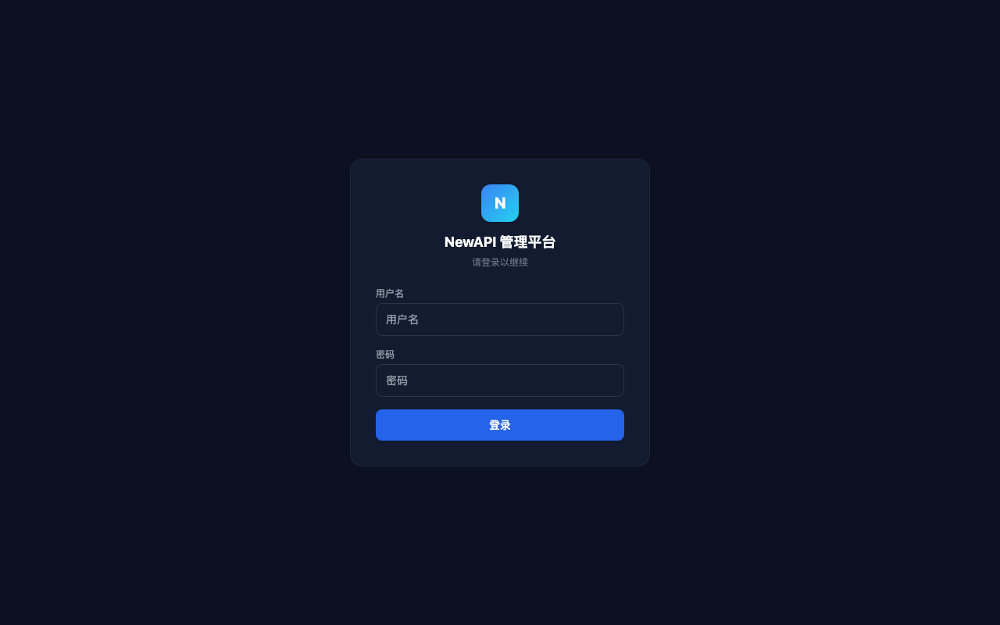
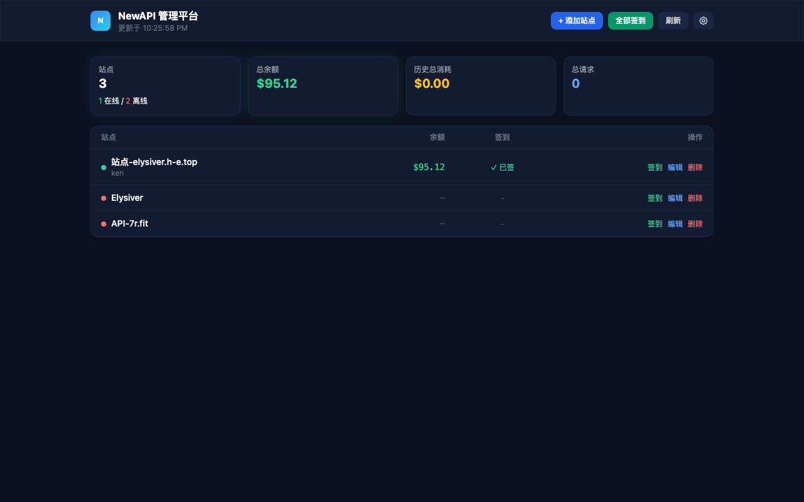
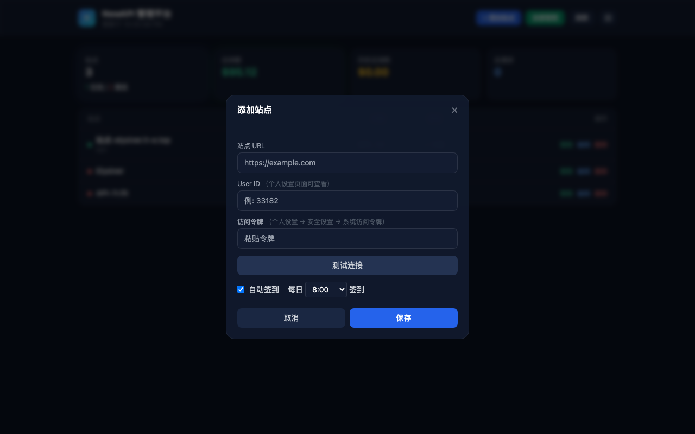
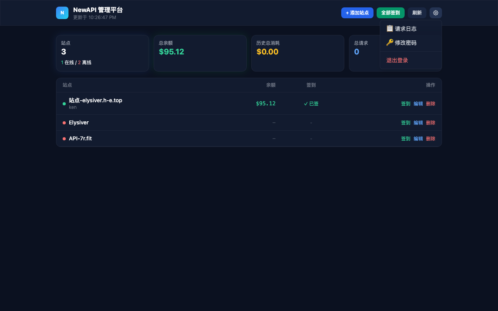
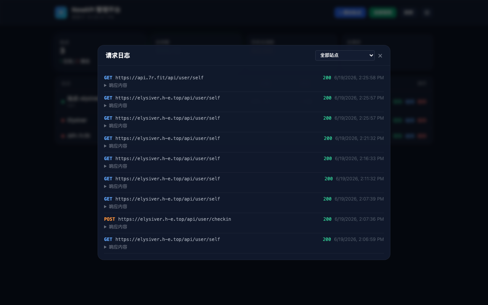

# NewAPI 管理平台

管理多个 NewAPI 中转站的 Web 工具。支持实时查看余额、历史消耗、自动签到，以及请求日志追踪。

## 界面预览

| 登录页面 | 主面板 |
|---------|--------|
|  |  |

| 添加站点 | 设置菜单 | 请求日志 |
|---------|---------|---------|
|  |  |  |

## 功能

- **站点管理**: 添加、编辑、删除 NewAPI 站点，通过令牌(Token)认证连接
- **余额监控**: 实时查看所有站点余额、历史消耗、请求次数，汇总展示
- **自动签到**: 支持为每个站点设置每日定时签到，可选 0-23 时任意整点
- **批量签到**: 一键为所有站点执行签到操作
- **请求日志**: 记录与每个站点的所有 API 通信，包含请求方法、URL、状态码、请求/响应内容，便于排查问题
- **账号认证**: 登录保护，支持修改密码，凭证通过环境变量配置
- **Docker 部署**: 提供 Dockerfile 和 docker-compose.yml，开箱即用

## 工作原理

本平台通过 NewAPI 的 REST API 与各中转站通信，使用的接口包括：

| 接口 | 用途 |
|------|------|
| `GET /api/user/self` | 获取用户信息（余额、消耗、请求数） |
| `POST /api/user/checkin` | 执行签到 |

认证方式：请求头携带 `Authorization: Bearer {access_token}` 和 `New-Api-User: {user_id}`。

访问令牌从 NewAPI 站点的 **个人设置 -> 安全设置 -> 系统访问令牌** 获取，不是 API Key（sk-xxx）。

## 快速开始

### 方式一：直接运行

```bash
# 安装依赖
pip install -r requirements.txt

# 复制环境变量配置
cp .env.example .env

# 编辑 .env，修改管理员密码和 SECRET_KEY
vim .env

# 启动
python app.py
```

访问 `http://localhost:5050`，使用 `.env` 中配置的账号密码登录。

### 方式二：Docker 部署

```bash
# 复制环境变量配置
cp .env.example .env

# 编辑 .env
vim .env

# 启动
docker compose up -d
```

数据存储在容器内的 `/app/instance` 目录，通过 docker-compose.yml 中的 volume 映射到宿主机的 `./data` 目录。

## 环境变量

在 `.env` 文件中配置：

| 变量 | 说明 | 默认值 |
|------|------|--------|
| `ADMIN_USER` | 管理员用户名 | `admin` |
| `ADMIN_PASS` | 管理员密码 | `admin123` |
| `SECRET_KEY` | Flask session 密钥，务必修改 | `newapi-manager-secret-key-change-me` |
| `PORT` | 服务端口 | `5050` |

**部署前必须修改 `ADMIN_PASS` 和 `SECRET_KEY`。**

## 添加站点

1. 登录后点击右上角「添加站点」
2. 填入站点 URL（如 `https://example.com`）
3. 填入 User ID（在 NewAPI 个人设置页面可查看）
4. 填入访问令牌（个人设置 -> 安全设置 -> 系统访问令牌）
5. 点击「测试连接」验证，成功后保存

## 技术栈

- **后端**: Python 3.9+ / Flask / SQLAlchemy / APScheduler
- **前端**: 原生 HTML + TailwindCSS（CDN）
- **数据库**: SQLite
- **部署**: Docker / Docker Compose

## 项目结构

```
.
├── app.py              # Flask 主程序，路由和业务逻辑
├── models.py           # 数据库模型（Site、CheckinRecord、RequestLog）
├── newapi_client.py    # NewAPI HTTP 客户端
├── templates/
│   ├── index.html      # 主页面
│   └── login.html      # 登录页面
├── requirements.txt    # Python 依赖
├── Dockerfile          # Docker 镜像配置
├── docker-compose.yml  # Docker Compose 编排
├── .env.example        # 环境变量模板
└── .gitignore
```

## 请求频率

默认配置下，对外站 API 的请求频率如下：

- 自动刷新：每 5 分钟一次（可手动点击刷新按钮）
- 服务端缓存：2 分钟 TTL，相同数据不重复请求
- 定时签到：每小时整点检查一次，仅在设定时间执行

正常使用的请求量很低，不会触发大多数中转站的限流机制。

## License

MIT
